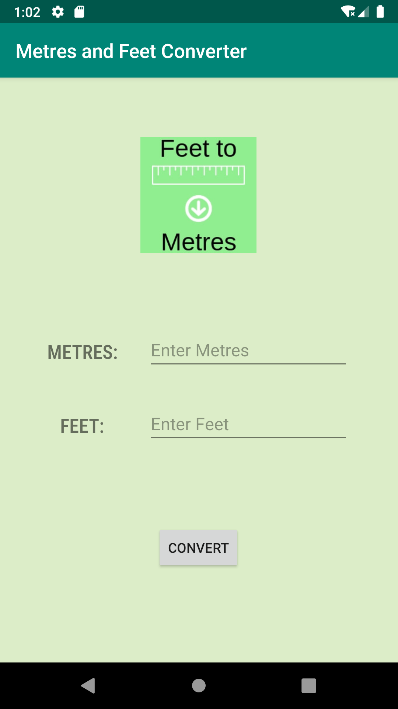
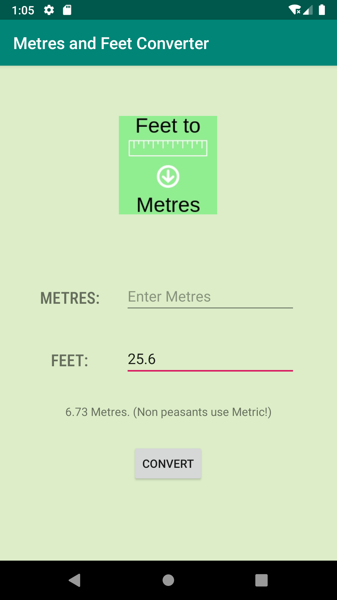
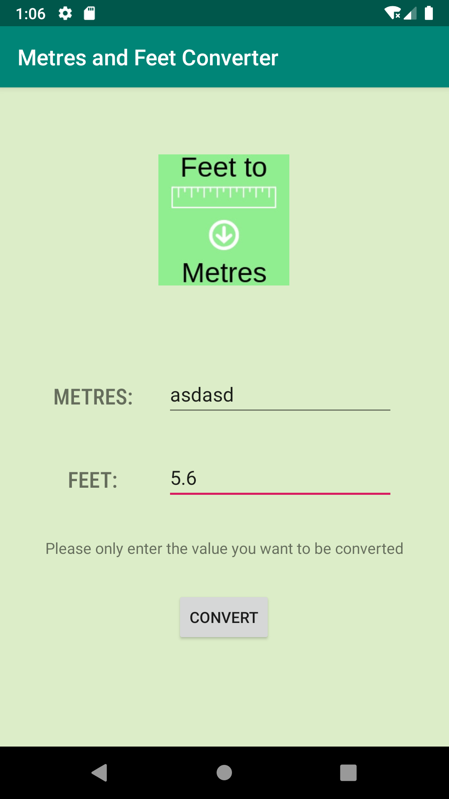

# metricConversionApp

This is a Android Application that let's you convert metres to feet and vice versa.

The main goal of this project for me to primarily learn git bash, and how to create a basic Android app with one Activity.

## Features
1. You can convert Feet to Metres (to 2 decimal places)
2. You can convert Metres to Feet (to 2 decimal places)
3. Error handling prevents crashing from incorrect user input

## Screenshots

 | 

|

